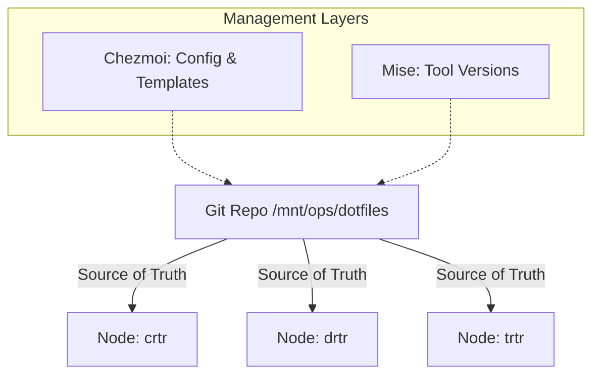

# Cluster Configuration Architecture

This document describes the architectural relationship between the central `dotfiles` repository, `chezmoi`, `mise`, and the cluster nodes.

## 🏗 Hub-and-Spoke Model

The Co-lab cluster follows a "Hub-and-Spoke" configuration model where a central Git repository defines the desired state for all nodes.

## 🛠 Configuration Layers

### Layer 1: System Packages (Apt/Brew)
Managed via `run_onchange_install_packages.sh.tmpl`. This script runs automatically whenever the package list in the template changes. It uses the native package manager for the OS (apt for Linux, brew for macOS).

### Layer 2: Environment & Shell (Chezmoi)
The core shell environment is defined in `dot_profile.tmpl`, `dot_zshrc.tmpl`, and `dot_bashrc.tmpl`. These templates use Go Template logic to adapt to:
- **OS**: Linux vs macOS
- **Architecture**: x86_64 vs ARM64
- **Node Role**: Gateway, GPU, Workstation

### Layer 3: Developer Tools (Mise)
Tool versions (Node, Python, Go, Bun, UV, etc.) are pinned in `dot_config/mise/config.toml`. 
- **Promotion Workflow**: To update a tool cluster-wide, update the version in this file, commit, and sync nodes.
- **Sync Trigger**: A `post-apply` hook in Chezmoi (or an `onchange` script) can trigger `mise install` to ensure the node state matches the new config immediately.

## 🔄 Synchronization Workflow

1.  **Modify**: Change a template or `mise` version in `/mnt/ops/dotfiles`.
2.  **Commit**: `git add . && git commit -m "..." && git push`.
3.  **Deploy**: Run `chezmoi update` on target nodes (or via DotDash Console).
4.  **Verify**: The DotDash Console visualizes the new state across the cluster.

## 🛰 Remote Execution
Commands executed via SSH (e.g., by the console) use `zsh -l -c 'command'` to ensure that the login shell environment is fully loaded, making `mise` shims and homebrew paths available to the execution context.
