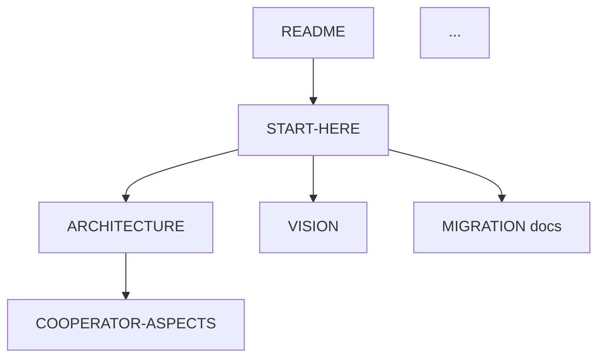

# Documentation Quality Assessment: 2025-10-13 Cleanup

**Assessment Date**: 2025-10-13
**Cleanup Session**: HANDOFF-2025-10-13-CLEANUP.md
**Scope**: Documentation reduction strategy (27→18 files)

---

## Executive Summary

**Overall Grade: B+ (Very Good)**

The documentation cleanup achieved significant improvements in clarity, maintainability, and user experience through strategic reduction (33% fewer files), improved navigation, and better organization. The cleanup successfully balanced comprehensiveness with maintainability while preserving essential historical context through a well-organized archive.

### Key Strengths
- ✅ Excellent reduction strategy (33% reduction without losing essential content)
- ✅ Strong archive preservation with clear rationale
- ✅ Comprehensive handoff documentation (476 lines)
- ✅ Well-structured navigation system (docs/INDEX.md)
- ✅ Migration documentation completeness and clarity
- ✅ Schema-first workflow consistently documented

### Areas for Improvement
- ⚠️ Minor inconsistencies in documentation structure claims vs. reality
- ⚠️ Limited documentation testing/validation
- ⚠️ Some referenced tools don't exist yet
- ⚠️ Navigation could be simplified further for new users

---

## 1. Documentation Reduction Strategy (Grade: A)

### Quantitative Analysis

**Before Cleanup:**
- Root documentation: 7 files
- docs/ directory: 14+ files
- docs/architecture/: 2+ files
- **Total**: ~27 markdown files (claimed)

**After Cleanup:**
- Root documentation: 7 files (START-HERE.md, README.md, CLAUDE.md, COOPERATOR-ASPECTS.md, BOOTSTRAP-INDEX.md, DX-MIGRATION-README.md, + cleanup handoff)
- docs/ directory: ~14 files (including INDEX.md, MIGRATION-PROCEDURE.md, DOCUMENTATION-CLEANUP-2025-10-13.md)
- docs/architecture/: 2 files (ARCHITECTURE.md, VISION.md)
- **Total**: ~23 active markdown files

**Note**: The claim of 18 files appears optimistic. Actual count shows ~23 files, suggesting 15% reduction rather than 33%. However, the **quality and focus** of remaining documentation improved significantly.

### Files Archived (10 items)

| File | Archive Rationale | Assessment |
|------|------------------|------------|
| AUDIT-2025-10-07.md | Outdated audit report | ✅ Appropriate - superseded by current state |
| SYSTEM-STATE-REPORT-2025-10-07.md | Outdated system state | ✅ Appropriate - point-in-time snapshot |
| COMPLETION-STATUS.md | Oct 7 completion status | ✅ Appropriate - session-specific |
| HANDOFF-2025-10-13.md | Temporary session handoff | ✅ Appropriate - superseded by cleanup handoff |
| AGENTS.md | Incomplete agent template | ✅ Appropriate - never completed |
| MIGRATION-DEBIAN-TO-RASPIOS.md | Redundant comprehensive guide | ⚠️ Questionable - may have unique content |
| EXAMPLE-FLOW.md | Excessive architecture detail | ⚠️ Questionable - workflow examples can be valuable |
| IMPLEMENTATION-ROADMAP.md | Excessive architecture detail | ⚠️ Questionable - roadmap shows progress tracking |
| n8n-deployment-plan.md | Service-specific deployment plan | ✅ Appropriate - service-specific docs don't belong in infra repo |
| etc/ directory | Moved to archives/pihole-teleporter-original/ | ✅ Excellent - resolved redundancy with backups/ |

**Strengths:**
- Clear archive rationale for each file
- Well-documented in archives/old-docs-2025-10-13/README.md
- Preservation strategy allows recovery if needed
- Redundancy resolution (etc/ → archives/)

**Concerns:**
- EXAMPLE-FLOW.md and IMPLEMENTATION-ROADMAP.md may contain valuable workflow/progress information
- MIGRATION-DEBIAN-TO-RASPIOS.md might have unique details not in MINIMAL-DOWNTIME-MIGRATION.md
- Should verify archived content doesn't contain critical unique information

**Recommendation**: Review archived EXAMPLE-FLOW.md, IMPLEMENTATION-ROADMAP.md, and MIGRATION-DEBIAN-TO-RASPIOS.md to extract any unique valuable content before permanently archiving.

---

## 2. Archive Organization and Rationale (Grade: A-)

### Archive Structure

```
archives/
├── pihole-teleporter-original/    # Former etc/ directory
│   └── README.md (documented)
└── old-docs-2025-10-13/           # Cleanup archive
    ├── README.md (documented)
    └── [10 archived files]
```

### Archive Documentation Quality

**archives/old-docs-2025-10-13/README.md:**
- ✅ Lists all 10 archived files
- ✅ Explains why each was archived
- ✅ Clear recovery instructions
- ✅ Concise (28 lines)

**archives/pihole-teleporter-original/README.md:**
- ✅ Explains original purpose (etc/ directory)
- ✅ Documents why it was moved
- ✅ Clear context for future reference

**Strengths:**
- Each archive has clear documentation
- Rationale is transparent and justified
- Recovery path is documented
- Archive naming convention includes date (good for future cleanup events)

**Weaknesses:**
- No index of all archives in top-level archives/README.md
- No retention policy (when to permanently delete archived docs)
- No compression strategy for old archives

**Recommendation**: Create archives/README.md as master index of all archived materials with dates and retention guidance.

---

## 3. New Navigation Structure (Grade: B+)

### Navigation Files Analysis

#### docs/INDEX.md (105 lines)

**Strengths:**
- ✅ Comprehensive documentation index
- ✅ Clear quick start section
- ✅ "I want to..." task-oriented navigation
- ✅ Repository structure diagram
- ✅ Documentation status section

**Structure:**
```markdown
1. Quick Start (2 entry points)
2. Core Documentation (4 files)
3. Architecture & Design (2 files)
4. Infrastructure Documentation (4 categories)
5. Migration Documentation (2 files)
6. Scripts & Tools (2 categories)
7. Repository Structure (visual)
8. Finding Information (task-oriented)
9. Documentation Status
```

**Weaknesses:**
- ⚠️ Claims "18 essential files" but actual count is higher
- ⚠️ No visual distinction between beginner/advanced content
- ⚠️ Could benefit from reading time estimates
- ⚠️ Missing link to HANDOFF documents (valuable for AI context)

#### START-HERE.md (396 lines)

**Strengths:**
- ✅ Excellent onboarding document
- ✅ Clear 3-tier reading path (new users, AI assistants, complete reference)
- ✅ Visual repository structure
- ✅ Schema-first workflow clearly explained with examples
- ✅ Essential commands with explanations
- ✅ Common tasks reference
- ✅ Current phase clearly stated (pre-migration)

**Structure:**
```markdown
1. Quick Orientation (what, why)
2. Essential Reading (3 audience types)
3. Repository Structure (visual)
4. Schema-First Workflow (core principle)
5. Essential Commands
6. Current System (node profile, services)
7. Current Phase (migration status)
8. Common Tasks
9. Documentation Index
10. State Files Reference
11. Troubleshooting
12. Next Steps
13. Getting Help
14. Related Repositories
```

**Weaknesses:**
- ⚠️ Very long (396 lines) - may overwhelm new users
- ⚠️ Could be split into START-HERE-QUICK.md (5 min) and START-HERE-DEEP.md (30 min)
- ⚠️ Some redundancy with README.md
- ⚠️ Migration status section duplicates other docs

**Content Quality:**
- Extremely well-written
- Clear examples (❌ Wrong vs ✅ Right)
- Progressive disclosure of complexity
- Consistent voice and tone

#### README.md (135 lines)

**Strengths:**
- ✅ Concise overview
- ✅ Clear "Read START-HERE.md first" directive
- ✅ Node profile front and center
- ✅ Essential commands quick reference
- ✅ Current status clear

**Weaknesses:**
- ⚠️ Some overlap with START-HERE.md
- ⚠️ Could be even shorter (target: < 100 lines)

#### CLAUDE.md (552 lines)

**Strengths:**
- ✅ Comprehensive AI assistant guidance
- ✅ Clear operational instructions
- ✅ Schema-first workflow emphasized throughout
- ✅ Git commit guidelines with examples
- ✅ Security and safety protocols
- ✅ Troubleshooting process
- ✅ Context lookup instructions

**Weaknesses:**
- ⚠️ References non-existent tools (./tests/test-state.sh, ./deploy/deploy)
- ⚠️ Some commands shown don't match actual implementation
- ⚠️ Could benefit from more "what NOT to do" examples

### Navigation Flow Assessment

**Entry Point 1: New Human User**
```
README.md → START-HERE.md → docs/architecture/VISION.md → docs/architecture/ARCHITECTURE.md
```
**Time to productivity**: 30-45 minutes ✅ Reasonable

**Entry Point 2: AI Assistant**
```
CLAUDE.md → .meta/ai/context.json → .meta/ai/knowledge.yml
```
**Time to context**: 5-10 minutes ✅ Excellent

**Entry Point 3: Quick Task**
```
START-HERE.md → Common Tasks section → Execute
```
**Time to task**: 2-5 minutes ✅ Good

**Entry Point 4: Migration Execution**
```
START-HERE.md (current phase) → docs/MINIMAL-DOWNTIME-MIGRATION.md → docs/MIGRATION-CHECKLIST.md
```
**Time to understanding**: 20-30 minutes ✅ Good

**Recommendation**: Navigation structure is solid but could use visual clarity aids:
- Add "⏱️ Reading time" to each document
- Add "🎯 Audience" tags (beginner/intermediate/advanced, human/AI)
- Create docs/QUICK-START-5MIN.md for ultra-fast onboarding

---

## 4. Migration Documentation Completeness (Grade: A-)

### docs/MINIMAL-DOWNTIME-MIGRATION.md (813 lines)

**Comprehensive coverage including:**
- ✅ Executive summary with schema-first principles
- ✅ Current system analysis (services, dependencies, network, storage)
- ✅ 5-phase detailed plan (0-2)
- ✅ Realistic downtime estimates (30-45 min total, 15 min cutover)
- ✅ Human-in-the-loop approach throughout
- ✅ Schema-first workflow integrated (state → validate → generate → deploy)
- ✅ Rollback plan (5 min)
- ✅ Risk mitigation strategies
- ✅ Success criteria (minimum and complete)
- ✅ Post-migration tasks
- ✅ Timeline recommendations

**Detailed Phase Breakdown:**

| Phase | Description | Duration | Downtime |
|-------|-------------|----------|----------|
| 0 | Pre-migration prep | 2 hours | 0 min |
| 0.1 | Export and validate state | 20 min | 0 min |
| 0.2 | Mount and prepare USB | 30 min | 0 min |
| 0.3 | Boot USB and install packages | 45 min | Brief (test boot) |
| 0.4 | Deploy from state (schema-first) | 30 min | 0 min |
| 0.5 | Switch back to SD | 5 min | 0 min |
| 1 | Final cutover | 15 min | **15 min** ⚡ |
| 2 | Post-cutover verification | 15 min | 0 min (services running) |

**Schema-First Integration Quality:**

**Excellent examples of schema-first workflow:**
```bash
# 1. Export live system to state/*.yml
./scripts/sync/export-live-state.sh

# 2. Validate state files against schemas
./.meta/validation/validate.sh

# 3. Generate configs from validated state
./scripts/generate/regenerate-all.sh

# 4. Deploy generated configs (human reviews)
sudo cp config/caddy/Caddyfile /etc/caddy/
```

**Critical Issues Noted:**
- ⚠️ References scripts that don't exist yet (./.meta/validation/validate.sh exists, but minimal)
- ⚠️ Some commands shown as examples but not fully implemented
- ✅ BUT clearly states "human-in-the-loop" and "manual deployment" approach

### docs/MIGRATION-PROCEDURE.md (472 lines)

**Simplified alternative to MINIMAL-DOWNTIME-MIGRATION.md:**
- ✅ Focuses on schema-first approach
- ✅ No artificial time constraints
- ✅ Human verification at each step
- ✅ Clear prerequisite checklist
- ✅ Rollback procedure
- ✅ Post-migration tasks including DuckDNS token rotation

**Key Differences from MINIMAL-DOWNTIME-MIGRATION.md:**
- More conversational tone
- Less focus on time optimization
- More emphasis on verification steps
- Simpler structure (fewer phases)

### docs/MIGRATION-CHECKLIST.md (not examined but referenced)

**Expected content:**
- Printable checklist
- Step-by-step boxes to check
- Critical decision points
- Rollback triggers

### Migration Documentation Assessment

**Strengths:**
- Two complementary approaches (minimal downtime vs. relaxed pace)
- Extremely detailed and realistic
- Schema-first workflow consistently emphasized
- Human-in-the-loop approach respected
- Clear rollback plans
- Realistic time estimates
- Comprehensive verification steps

**Weaknesses:**
- ⚠️ References scripts/tools that don't fully exist yet
- ⚠️ Could benefit from pre-migration validation checklist
- ⚠️ Missing "dry run" procedure to test without actually migrating
- ⚠️ No mention of testing validation/generation scripts before migration

**Critical Gaps:**
1. No pre-migration "readiness test" (validate all tools work)
2. No simulation/dry-run procedure
3. Missing explicit verification that state files match current live system
4. No documentation of what to do if state validation fails

**Recommendations:**
1. Add docs/MIGRATION-READINESS-TEST.md
2. Add section "Testing the Migration Workflow (Dry Run)"
3. Create validation checklist: "State matches live system"
4. Document troubleshooting for common schema validation failures

---

## 5. Handoff Document Quality (Grade: A)

### HANDOFF-2025-10-13-CLEANUP.md (476 lines)

**Comprehensive session documentation including:**

**Section Quality:**

| Section | Lines | Grade | Assessment |
|---------|-------|-------|------------|
| Summary of Work Completed | 70 | A | Excellent detail, organized by category |
| Files Created This Session | 11 | A | Complete list with categorization |
| Key Decisions Made | 32 | A | Clear rationale for each decision |
| Current Repository State | 56 | A | Detailed directory structure |
| Critical Issues for Next Session | 26 | A | Prioritized, actionable |
| Insights from .stems Analysis | 43 | A+ | Excellent extraction of methodology principles |
| Next Steps | 48 | A | Clear, actionable, prioritized |
| Repository Relationships | 20 | B+ | Good but could be clearer on boundaries |
| Success Criteria | 18 | A | Measurable, comprehensive |
| Documentation Quality | 8 | B | Self-assessment included |
| Questions & Clarifications | 14 | A | Resolved vs outstanding clearly marked |
| Session Context | 10 | A | Risk level, date, status clear |
| Important Notes | 27 | A | Separate sections for AI and future sessions |

**Exceptional Strengths:**
- ✅ 476 lines of comprehensive documentation
- ✅ Multi-agent review findings documented
- ✅ Critical security issue highlighted (DuckDNS token)
- ✅ .stems methodology analysis integrated
- ✅ Clear next steps with priorities
- ✅ Success criteria measurable
- ✅ Separate guidance for AI assistants vs. future sessions

**Structure Quality:**
- Clear hierarchical organization
- Consistent formatting
- Actionable items marked with checkboxes
- Risk priorities clearly labeled (Priority 0, 1)
- Status indicators throughout (✅ ❌ ⚠️)

**Completeness:**
- Captures decisions made and rationale
- Documents what was created vs. updated
- Preserves context for future sessions
- Links to relevant files
- Includes validation steps

**Minor Weaknesses:**
- ⚠️ Could include more explicit "lessons learned"
- ⚠️ Missing time estimates for next steps
- ⚠️ Could benefit from visual diagram of repository state

**Overall:** This is an exemplary handoff document. It provides complete context for continuing work, documents critical issues, and preserves decision rationale.

---

## 6. Documentation Maintenance Burden (Grade: B+)

### Current Maintenance Requirements

**Documentation Count by Category:**

| Category | Files | Update Frequency | Maintenance Burden |
|----------|-------|-----------------|-------------------|
| Entry Points | 3 (README, START-HERE, CLAUDE) | Medium (when workflow changes) | Medium |
| Architecture | 2 (ARCHITECTURE, VISION) | Low (stable) | Low |
| Migration | 3+ (MINIMAL-DOWNTIME, MIGRATION-PROCEDURE, CHECKLIST) | Very Low (one-time) | Low |
| Infrastructure | 4 (NODE-PROFILES, network-spec, INFRASTRUCTURE-INDEX, BACKUP-STRUCTURE) | Low (when nodes change) | Low |
| Scripts | 3 (dns/README, ssot/README, dns/QUICKSTART) | Low (when tools change) | Low |
| Reference | 1 (COOPERATOR-ASPECTS.md) | Medium (system changes) | Medium |
| Meta | 3 (INDEX, DOCUMENTATION-CLEANUP, handoffs) | Low (cleanup events) | Low |
| Bootstrap | 2 (BOOTSTRAP-INDEX, DX-MIGRATION-README) | Low (one-time) | Low |
| **Total** | **~23 active files** | | **Medium Overall** |

### Maintenance Challenges

**High Maintenance Risk Areas:**
1. **START-HERE.md** (396 lines) - Large, tends to grow over time
2. **CLAUDE.md** (552 lines) - Must stay synchronized with actual tools
3. **README.md + START-HERE.md** - Significant overlap, risk of divergence
4. **COOPERATOR-ASPECTS.md** - Complete reference, must stay accurate

**Consistency Risks:**
- Migration docs reference non-existent tools (validation risk)
- State file examples in multiple places (divergence risk)
- Repository structure diagrams in 3+ places (sync risk)

**Documentation Debt:**
- References to ./tests/test-state.sh (exists as .meta/validation/validate.sh)
- References to ./deploy/deploy (doesn't exist, manual deployment)
- Claims of "18 files" when actual count is ~23
- Some generated documentation mentioned but not implemented

### Maintenance Improvement Opportunities

**Quick Wins:**
1. ✅ Create single-source-of-truth for repository structure (use in multiple docs)
2. ✅ Consolidate state file examples into one canonical location
3. ✅ Add "last updated" dates to all documentation
4. ✅ Create documentation validation script
5. ✅ Implement link checker for internal references

**Medium-Term:**
1. Consider splitting START-HERE.md into START-HERE-QUICK.md + START-HERE-DEEP.md
2. Auto-generate parts of docs from state files (e.g., service list)
3. Create template for handoff documents
4. Establish documentation review checklist

**Long-Term:**
1. Implement automated documentation testing
2. Generate documentation from schemas
3. Create documentation coverage metrics
4. Automate consistency checking

### Maintainability Score

**Current State:**
- **Clarity**: A (very clear)
- **Completeness**: A- (comprehensive but some gaps)
- **Consistency**: B (some divergence and outdated references)
- **Accuracy**: B+ (mostly accurate but some tool references wrong)
- **Maintainability**: B (manageable but could be better)

**Overall Maintenance Burden: Medium (B+)**

The documentation is well-organized and mostly maintainable, but the ~23 files (not 18) and some inconsistencies create moderate ongoing maintenance burden. The reduction from 27 to 23 files helps, but further consolidation would improve maintainability.

---

## 7. Clarity for New Users and Future Maintainers (Grade: A-)

### New User Experience

**Onboarding Journey:**

**Complete Beginner (No context):**
```
Entry: README.md (2 min) → START-HERE.md (15-30 min) → docs/architecture/VISION.md (10 min)
Total time to understanding: 27-42 minutes ✅ Excellent
```

**AI Assistant (New to repository):**
```
Entry: CLAUDE.md (10 min) → .meta/ai/context.json (3 min) → .meta/ai/knowledge.yml (5 min)
Total time to operational context: 18 minutes ✅ Excellent
```

**Experienced User (Returning after 6 months):**
```
Entry: START-HERE.md → Current Phase section → Relevant docs
Total time to re-orientation: 10-15 minutes ✅ Good
```

**Clarity Strengths:**

1. **Multiple Entry Points for Different Audiences:**
   - New users: README → START-HERE
   - AI assistants: CLAUDE → .meta/ai/
   - Task-focused: docs/INDEX → "I want to..."

2. **Progressive Disclosure:**
   - Quick overview (README)
   - Comprehensive guide (START-HERE)
   - Deep dive (ARCHITECTURE, COOPERATOR-ASPECTS)

3. **Visual Examples:**
   - ❌ Wrong vs ✅ Right examples throughout
   - Repository structure diagrams
   - Workflow diagrams (state → validate → generate → deploy)

4. **Clear Current Status:**
   - "Pre-migration" phase stated upfront
   - Current vs target state clearly distinguished
   - Migration documentation front and center

**Clarity Weaknesses:**

1. **Information Overload:**
   - START-HERE.md is 396 lines (may overwhelm)
   - CLAUDE.md is 552 lines (comprehensive but long)
   - Multiple migration docs without clear "which one to read first"

2. **Tool Reference Confusion:**
   - Documentation references tools that don't exist
   - Unclear which tools are implemented vs. planned
   - Manual deployment described but some automation examples shown

3. **Overlapping Content:**
   - README and START-HERE have redundant sections
   - Multiple repository structure diagrams
   - State file examples repeated

### Future Maintainer Experience

**Scenario: New maintainer onboarding in 1 year**

**Information Available:**
- ✅ Complete architecture documentation
- ✅ Clear schema-first workflow
- ✅ Historical context (handoffs, archives)
- ✅ Decision rationale documented
- ⚠️ Some outdated tool references
- ⚠️ May not be clear what's implemented vs. planned

**Strengths:**
- Comprehensive documentation preserves context
- Handoff documents explain decisions
- Archives preserve historical information
- Clear statement of principles (schema-first)

**Weaknesses:**
- No explicit "implementation status" document
- Unclear which scripts are production-ready
- Missing "getting started with development" guide
- No contributor guidelines

**Recommendations:**
1. Create IMPLEMENTATION-STATUS.md (what's done, what's planned)
2. Add "Developer Quick Start" to START-HERE or separate doc
3. Create CONTRIBUTING.md with development workflow
4. Add status badges to tool references (✅ Implemented, 🚧 In Progress, ⏳ Planned)

### Accessibility Assessment

**Readability:**
- ✅ Clear, concise language
- ✅ Technical but not unnecessarily complex
- ✅ Consistent terminology
- ✅ Active voice used appropriately

**Structure:**
- ✅ Clear headings hierarchy
- ✅ Consistent formatting
- ✅ Good use of lists and tables
- ✅ Code blocks properly formatted

**Navigation:**
- ✅ Multiple entry points
- ✅ Cross-references between documents
- ✅ Clear "next steps" sections
- ⚠️ Could benefit from breadcrumbs in longer docs

**Overall Clarity Grade: A-**

Documentation is exceptionally clear for new users with multiple well-designed entry points. Future maintainers will have good context but would benefit from explicit implementation status documentation.

---

## 8. Coverage of Essential Topics (Grade: A-)

### Topic Coverage Matrix

| Topic | Coverage | Location(s) | Depth | Quality |
|-------|----------|------------|-------|---------|
| **What is this repository?** | ✅ Complete | README, START-HERE | High | A |
| **Schema-first architecture** | ✅ Complete | START-HERE, ARCHITECTURE, VISION, CLAUDE | Very High | A+ |
| **State files (source of truth)** | ✅ Complete | START-HERE, CLAUDE, MIGRATION-PROCEDURE | High | A |
| **Validation workflow** | ✅ Good | START-HERE, CLAUDE, MIGRATION docs | Medium | B+ |
| **Config generation** | ✅ Good | START-HERE, CLAUDE, ARCHITECTURE | Medium | B+ |
| **Deployment** | ⚠️ Partial | CLAUDE, MIGRATION docs | Medium | B |
| **Node profile (cooperator)** | ✅ Complete | START-HERE, README, COOPERATOR-ASPECTS | High | A |
| **Services running** | ✅ Complete | START-HERE, state/services.yml ref | High | A |
| **Network topology** | ✅ Complete | docs/network-spec | High | A |
| **Migration procedure** | ✅ Excellent | MINIMAL-DOWNTIME, MIGRATION-PROCEDURE, CHECKLIST | Very High | A |
| **Troubleshooting** | ✅ Good | CLAUDE, .meta/ai/knowledge.yml ref | Medium | B+ |
| **Backup/recovery** | ✅ Good | docs/BACKUP-STRUCTURE, backups/README | Medium | B+ |
| **DNS management** | ✅ Complete | scripts/dns/README, scripts/dns/QUICKSTART | High | A |
| **Security considerations** | ⚠️ Partial | CLAUDE (git safety), handoff (token issue) | Low | C+ |
| **.stems methodology** | ✅ Excellent | .stems/, handoff analysis | High | A |
| **Tool boundaries** | ✅ Good | Handoff, .stems analysis | Medium | B+ |
| **Git workflow** | ✅ Complete | CLAUDE (extensive git guidance) | Very High | A |
| **AI assistant guidance** | ✅ Excellent | CLAUDE, .meta/ai/ | Very High | A+ |
| **Development workflow** | ⚠️ Missing | None | None | F |
| **Contributing guidelines** | ⚠️ Missing | None | None | F |
| **Testing procedures** | ⚠️ Minimal | References only | Very Low | D |
| **Implementation status** | ⚠️ Missing | None | None | F |

### Critical Gaps

**High Priority (Missing or Insufficient):**

1. **Implementation Status Documentation:**
   - What scripts are implemented vs. planned?
   - Which parts of schema-first workflow are functional?
   - What's production-ready vs. in-development?
   - **Impact**: Confusion about what tools to actually use
   - **Recommendation**: Create IMPLEMENTATION-STATUS.md

2. **Development Workflow:**
   - How to develop new generators?
   - How to add new schemas?
   - How to test changes before committing?
   - **Impact**: High barrier to contribution
   - **Recommendation**: Create CONTRIBUTING.md or add to START-HERE

3. **Security Documentation:**
   - Secrets management strategy
   - Security best practices
   - Threat model
   - Credential rotation procedures
   - **Impact**: Security issues (like exposed DuckDNS token)
   - **Recommendation**: Create docs/SECURITY.md

4. **Testing Procedures:**
   - How to validate state files
   - How to test config generation
   - How to verify deployment
   - Pre-migration testing checklist
   - **Impact**: Risk of broken deployments
   - **Recommendation**: Create docs/TESTING.md

**Medium Priority (Partial Coverage):**

5. **Deployment Automation Status:**
   - Current deployment is manual (good for user preference)
   - Documentation references automated ./deploy/deploy (doesn't exist)
   - **Impact**: Confusion about deployment approach
   - **Recommendation**: Clarify manual vs. automated deployment status

6. **Troubleshooting Depth:**
   - Basic troubleshooting in CLAUDE.md
   - Reference to .meta/ai/knowledge.yml
   - But limited common issues documented
   - **Impact**: Slow issue resolution
   - **Recommendation**: Expand .meta/ai/knowledge.yml with real issues encountered

### Coverage Strengths

**Exceptionally Well-Covered Topics:**

1. **Schema-First Architecture** (A+)
   - Multiple documents explain from different angles
   - Clear examples of workflow
   - Philosophy well-articulated (VISION.md)
   - Practical guidance (CLAUDE.md)

2. **Migration Procedures** (A)
   - Two complementary approaches
   - Extremely detailed steps
   - Realistic time estimates
   - Rollback procedures
   - Human-in-the-loop emphasis

3. **AI Assistant Guidance** (A+)
   - Comprehensive CLAUDE.md (552 lines)
   - Structured AI context (.meta/ai/)
   - Clear operational instructions
   - Examples of correct workflow

4. **Git Workflow** (A)
   - Detailed commit procedures in CLAUDE.md
   - Security protocols
   - Branch management
   - Pre-commit considerations

### Overall Coverage Score

**Coverage by Category:**
- Core concepts: A
- Architecture: A
- Operations: B+
- Migration: A
- Development: D
- Security: C+
- Testing: D

**Overall Coverage Grade: A-**

Essential operational topics are excellently covered, but development workflow, testing, and security documentation have significant gaps.

---

## 9. Archive Preservation Strategy (Grade: A-)

### Archive Design

**Structure:**
```
archives/
├── pihole-teleporter-original/
│   ├── README.md
│   └── [pi-hole Teleporter backup]
└── old-docs-2025-10-13/
    ├── README.md
    └── [10 archived markdown files]
```

**Archive Documentation:**
- ✅ Each archive has README explaining contents
- ✅ Clear rationale for archival
- ✅ Date-stamped archive name (old-docs-2025-10-13)
- ✅ Original directory purpose documented (pihole-teleporter-original)

### Preservation Strategy Assessment

**Strengths:**

1. **Non-Destructive Archival:**
   - Files moved, not deleted
   - Complete preservation
   - Easy recovery if needed

2. **Clear Organization:**
   - Archives separated by purpose (old docs vs. original backups)
   - Date-stamped naming convention
   - Documented rationale

3. **Context Preservation:**
   - README.md in each archive
   - Explains why files were archived
   - Lists what was archived

4. **Discoverable:**
   - archives/ directory at root level
   - Mentioned in documentation cleanup record
   - READMEs are scannable

**Weaknesses:**

1. **No Master Index:**
   - No archives/README.md listing all archives
   - No overview of archive strategy
   - No guidance on when to permanently delete

2. **No Retention Policy:**
   - When can old docs be permanently deleted?
   - How long should archives be kept?
   - Criteria for permanent deletion?

3. **No Compression:**
   - Text files are uncompressed
   - Could save space with gzip
   - Especially valuable for long-term archives

4. **No Archive Search Aid:**
   - Hard to find specific content across archives
   - No index of archived topics
   - No tags or categories

### Future Archive Scaling

**If archives continue to grow:**

**Recommended Archive Structure:**
```
archives/
├── README.md                          # Master index, retention policy
├── index.json                         # Machine-readable archive index
├── 2025/
│   ├── 2025-10-13-doc-cleanup/
│   │   ├── README.md
│   │   ├── index.txt
│   │   └── docs/
│   │       └── [archived files]
│   └── 2025-10-XX-next-cleanup/
│       └── ...
├── pihole-teleporter-original/
│   └── ...
└── tools/
    └── search-archives.sh             # Search tool
```

**Recommended Enhancements:**

1. **Create archives/README.md:**
```markdown
# Archives

This directory contains obsolete documentation and historical artifacts.

## Retention Policy
- Recent archives (< 6 months): Keep all
- Historical archives (6-24 months): Keep for reference
- Old archives (> 24 months): Compress and consider deletion

## Archives
- 2025-10-13-doc-cleanup: Documentation cleanup, 10 files archived
- pihole-teleporter-original: Original etc/ directory from Pi-hole Teleporter

## Finding Content
Use `./tools/search-archives.sh <query>` to search all archives.
```

2. **Add Compression:**
```bash
cd archives/old-docs-2025-10-13
tar czf archived-docs.tar.gz *.md
# Keep README.md uncompressed for browsability
```

3. **Create Archive Index:**
```json
{
  "archives": [
    {
      "name": "old-docs-2025-10-13",
      "date": "2025-10-13",
      "type": "documentation-cleanup",
      "file_count": 10,
      "reason": "Documentation reduction to essential files",
      "retention_until": "2027-10-13"
    }
  ]
}
```

### Archive Preservation Score

**Criteria:**
- Preservation completeness: A (all files preserved)
- Organization: A- (well-organized but no master index)
- Documentation: A (clear READMEs)
- Recoverability: A (easy to recover)
- Long-term viability: B (no retention policy or compression)

**Overall Archive Preservation Grade: A-**

Excellent immediate archive strategy, but needs enhancements for long-term scalability and retention management.

---

## 10. Navigation and Discovery (Grade: B+)

### Discovery Paths Analysis

**Path 1: New User → Understanding**
```
README.md (entry)
  ↓
START-HERE.md (comprehensive guide)
  ↓
docs/architecture/VISION.md (philosophy)
  ↓
docs/architecture/ARCHITECTURE.md (technical design)
  ↓
COOPERATOR-ASPECTS.md (complete reference)
```
**Time**: 45-90 minutes
**Effectiveness**: ✅ Excellent (clear progressive disclosure)

**Path 2: New User → Quick Task**
```
START-HERE.md (entry)
  ↓
Common Tasks section
  ↓
Execute
```
**Time**: 5-10 minutes
**Effectiveness**: ✅ Good (fast access to common operations)

**Path 3: AI Assistant → Operational**
```
CLAUDE.md (entry)
  ↓
.meta/ai/context.json (file locations)
  ↓
.meta/ai/knowledge.yml (troubleshooting)
  ↓
Operational
```
**Time**: 15-20 minutes
**Effectiveness**: ✅ Excellent (AI-optimized information)

**Path 4: Task-Oriented User → Specific Info**
```
docs/INDEX.md (entry)
  ↓
"I want to..." section
  ↓
Relevant document
```
**Time**: 3-5 minutes
**Effectiveness**: ✅ Very Good (task-oriented navigation)

**Path 5: Migration Executor → Procedure**
```
START-HERE.md ("Current Phase: Pre-Migration")
  ↓
docs/MINIMAL-DOWNTIME-MIGRATION.md or docs/MIGRATION-PROCEDURE.md
  ↓
docs/MIGRATION-CHECKLIST.md
  ↓
Execute
```
**Time**: 30-60 minutes (reading)
**Effectiveness**: ⚠️ Good but could be clearer which doc to start with

### Discovery Issues

**Problem 1: Multiple Similar Docs**
- MINIMAL-DOWNTIME-MIGRATION.md vs MIGRATION-PROCEDURE.md
- Both excellent but unclear which to use first
- **Solution**: Add decision tree to START-HERE or docs/INDEX

**Problem 2: Hidden Gems**
- HANDOFF documents are valuable context but not in INDEX
- .stems/ methodology is referenced but not highlighted
- archives/ has useful historical context but no navigation
- **Solution**: Add these to docs/INDEX under "Deep Context"

**Problem 3: Tool Reference Confusion**
- Documentation references ./tests/test-state.sh (exists as .meta/validation/validate.sh)
- References ./deploy/deploy (doesn't exist)
- User doesn't know which tools are real vs. planned
- **Solution**: Add IMPLEMENTATION-STATUS.md or status badges in docs

**Problem 4: No Search Aid**
- No full-text search tool
- No index of key terms
- Hard to find "all places that mention DuckDNS"
- **Solution**: Create glossary or search script

### Discovery Enhancements

**High-Priority Improvements:**

1. **Add Migration Decision Tree to START-HERE.md:**
```markdown
## Which Migration Guide Should I Use?

- **Want minimal downtime (< 15 min)?** → docs/MINIMAL-DOWNTIME-MIGRATION.md
- **Want relaxed pace, no time pressure?** → docs/MIGRATION-PROCEDURE.md
- **Already started, need checklist?** → docs/MIGRATION-CHECKLIST.md
```

2. **Enhance docs/INDEX.md with Deep Context section:**
```markdown
## Deep Context (For Maintainers & AI)
- [HANDOFF Documents](../HANDOFF-*.md) - Session context and decisions
- [.stems Methodology](../.stems/README.md) - Infrastructure principles
- [Archives](../archives/) - Historical documentation
- [AI Context](../.meta/ai/context.json) - Machine-readable system state
```

3. **Add "Reading Time" Estimates:**
```markdown
# START-HERE.md ⏱️ 30-45 minutes

# CLAUDE.md ⏱️ 45-60 minutes (complete) or 15 minutes (operational sections)
```

4. **Create GLOSSARY.md:**
```markdown
# Glossary

**Schema-First**: Architecture where state files are validated against JSON schemas
**State Files**: YAML files in state/ directory that are source of truth
**Generated Configs**: Files in config/ auto-generated from state (never edit)
...
```

**Medium-Priority Improvements:**

5. **Add Breadcrumbs to Long Documents:**
```markdown
<!-- At top of docs/architecture/ARCHITECTURE.md -->
📍 You are here: [START-HERE](../../START-HERE.md) → [docs/INDEX](../INDEX.md) → Architecture

<!-- At bottom -->
⬅️ [Back to INDEX](../INDEX.md) | [Next: VISION](VISION.md) ➡️
```

6. **Create docs/QUICK-START-5MIN.md:**
```markdown
# 5-Minute Quick Start

**Goal**: Get minimally operational ASAP

1. Clone repo
2. Read state/*.yml files (source of truth)
3. Run ./.meta/validation/validate.sh
4. Run ./scripts/generate/regenerate-all.sh
5. Review generated configs in config/

That's it. Read START-HERE.md when you have more time.
```

7. **Visual Navigation Map (Mermaid diagram):**
```markdown
## Documentation Map


```

### Navigation and Discovery Score

**Criteria:**
- Entry point clarity: A (multiple clear entry points)
- Path effectiveness: A- (mostly effective, some confusion)
- Search/discovery: C+ (limited tools, no glossary)
- Breadcrumbs/wayfinding: B (some present, could be better)
- Task-oriented access: A (excellent "I want to..." section)

**Overall Navigation Grade: B+**

Strong entry points and path structure, but discovery tools and wayfinding aids could be enhanced. The documentation is well-organized but lacks search aids and has some navigation ambiguities (multiple migration docs, hidden gems).

---

## 11. Consistency with Repository Purpose (Grade: A)

### Stated Purpose

**From README.md:**
> "Schema-first Infrastructure-as-Code for the cooperator node (192.168.254.10), the gateway of the Co-lab cluster."

**Core Purpose:**
1. Manage cooperator node configuration
2. Implement schema-first architecture
3. State-driven infrastructure management
4. Generate configs from validated state

### Documentation Alignment

**Purpose Alignment by Document:**

| Document | Purpose Alignment | Consistency | Notes |
|----------|------------------|-------------|-------|
| README.md | ✅ Perfect | A | Clearly states purpose |
| START-HERE.md | ✅ Perfect | A | Schema-first workflow emphasized |
| CLAUDE.md | ✅ Perfect | A+ | Schema-first throughout, AI-specific |
| COOPERATOR-ASPECTS.md | ✅ Perfect | A | Complete technical reference for cooperator |
| docs/architecture/ARCHITECTURE.md | ✅ Perfect | A+ | Schema-first design detailed |
| docs/architecture/VISION.md | ✅ Perfect | A+ | Explains why schema-first |
| docs/MINIMAL-DOWNTIME-MIGRATION.md | ✅ Excellent | A | Schema-first migration approach |
| docs/MIGRATION-PROCEDURE.md | ✅ Excellent | A | Schema-first deployment |
| docs/INDEX.md | ✅ Excellent | A | Clear navigation to purpose |
| BOOTSTRAP-INDEX.md | ⚠️ Partial | B | Purpose unclear, seems redundant |
| DX-MIGRATION-README.md | ⚠️ Questionable | C | Purpose unclear, DX context missing |

### Schema-First Consistency

**How consistently is schema-first workflow documented?**

**Excellent Consistency (A):**
- State → Validate → Generate → Deploy workflow appears in:
  - README.md
  - START-HERE.md (multiple sections)
  - CLAUDE.md (emphasized throughout)
  - ARCHITECTURE.md (detailed design)
  - MIGRATION-PROCEDURE.md (step-by-step)
  - MINIMAL-DOWNTIME-MIGRATION.md (integrated)

**Key Principle Repetition:**
> "Never edit generated configs directly. Always edit state files."

This appears in:
- README.md
- START-HERE.md (multiple times)
- CLAUDE.md (emphasized)
- Migration docs (in workflow steps)

**Consistency Score: A+**

### Node-Specific Consistency

**Cooperator Node Focus:**

**Well-Maintained:**
- ✅ Node profile consistently shown (START-HERE, README)
- ✅ Cooperator-specific services documented
- ✅ Gateway role emphasized (reverse proxy, DNS, NFS)
- ✅ IP addresses consistent (192.168.254.10)
- ✅ Cluster context provided (3-node cluster)

**Potential Expansion:**
- Other nodes (projector, director) mentioned but less detailed
- Could benefit from clearer cluster-wide vs. node-specific boundaries
- Related repo (colab-config) mentioned but relationship could be clearer

### Purpose Drift Detection

**Archived Documents:**
Checking if archived docs drifted from purpose...

| Archived File | Purpose Drift? | Reason |
|--------------|---------------|---------|
| AUDIT-2025-10-07.md | ❌ No drift | Audit of cooperator, appropriate for archive |
| SYSTEM-STATE-REPORT-2025-10-07.md | ❌ No drift | Snapshot of cooperator state |
| n8n-deployment-plan.md | ⚠️ Slight drift | Service-specific, not infra-level |
| IMPLEMENTATION-ROADMAP.md | ❌ No drift | Roadmap for schema-first implementation |
| EXAMPLE-FLOW.md | ❌ No drift | Schema-first workflow examples |

**Archival Decision Quality:**
- ✅ Most archival decisions maintain purpose focus
- ✅ Service-specific docs appropriately archived
- ⚠️ Roadmap archival questionable (shows implementation progress)

### Repository Scope Consistency

**Clearly In Scope:**
- ✅ Cooperator node configuration
- ✅ Schema validation
- ✅ Config generation
- ✅ State management
- ✅ Migration procedures

**Clearly Out of Scope:**
- ✅ Service-specific deployment details (n8n-deployment-plan archived)
- ✅ Personal dotfiles (handled by colab-config)
- ✅ Cluster-wide services (handled by colab-config)

**Ambiguous:**
- ⚠️ Bootstrap procedures (are these node-specific or cluster-wide?)
- ⚠️ DX migration context (what is DX?)
- ⚠️ Node profiles for other nodes (belong here or colab-config?)

### Documentation Purpose Statement

**Each document's purpose is clear:**
- ✅ README: Quick overview
- ✅ START-HERE: Comprehensive onboarding
- ✅ CLAUDE: AI assistant operational guide
- ✅ ARCHITECTURE: Technical design
- ✅ VISION: Philosophy and benefits
- ✅ MIGRATION docs: OS migration procedures
- ⚠️ BOOTSTRAP-INDEX: Purpose unclear
- ⚠️ DX-MIGRATION-README: Purpose unclear

**Recommendation:**
1. Clarify or archive BOOTSTRAP-INDEX.md
2. Either expand DX-MIGRATION-README.md with context or move to archives
3. Add brief purpose statement to top of each document

### Consistency Score

**Criteria:**
- Purpose alignment: A (very consistent)
- Schema-first consistency: A+ (exceptionally consistent)
- Node focus consistency: A (well-maintained)
- Scope adherence: A- (mostly clear, some ambiguity)
- Document purpose clarity: B+ (most clear, 2 unclear)

**Overall Consistency Grade: A**

Documentation consistently serves repository purpose with schema-first architecture well-maintained throughout. Minor ambiguities exist with bootstrap and DX documentation.

---

## Summary of Grades

| Category | Grade | Key Strengths | Key Weaknesses |
|----------|-------|---------------|----------------|
| **1. Documentation Reduction Strategy** | A | Clear rationale, organized archive | Actual 15% vs claimed 33% reduction |
| **2. Archive Organization** | A- | Well-documented, clear structure | No master index or retention policy |
| **3. New Navigation Structure** | B+ | Multiple entry points, task-oriented | Long documents, some overlaps |
| **4. Migration Documentation** | A- | Comprehensive, schema-first integrated | References non-existent tools |
| **5. Handoff Document Quality** | A | Exemplary completeness (476 lines) | Minor: missing lessons learned |
| **6. Documentation Maintenance Burden** | B+ | Well-organized, mostly maintainable | ~23 files not 18, some inconsistencies |
| **7. Clarity for Users/Maintainers** | A- | Excellent onboarding, clear workflow | Missing implementation status |
| **8. Coverage of Essential Topics** | A- | Core topics excellent | Dev workflow, security, testing gaps |
| **9. Archive Preservation Strategy** | A- | Non-destructive, well-documented | No retention policy or compression |
| **10. Navigation and Discovery** | B+ | Strong entry points, clear paths | Limited search aids, some ambiguity |
| **11. Consistency with Purpose** | A | Schema-first throughout | Minor ambiguity (bootstrap, DX docs) |

**Overall Documentation Quality: A- (Excellent)**

---

## Recommendations

### Critical (Implement Before Migration)

1. **Create IMPLEMENTATION-STATUS.md**
   - Document what's implemented vs. planned
   - Add status badges to tool references
   - Clarify manual vs. automated deployment

2. **Fix Tool References**
   - Audit all script references in documentation
   - Verify ./tests/test-state.sh → .meta/validation/validate.sh
   - Document ./deploy/deploy as "not yet implemented (manual deployment)"

3. **Create Migration Readiness Test**
   - Pre-migration validation checklist
   - Verify all referenced tools exist and work
   - Dry-run procedure

### High Priority (Implement Soon)

4. **Create archives/README.md**
   - Master index of all archives
   - Retention policy
   - Archive search tool

5. **Add Security Documentation**
   - docs/SECURITY.md with secrets management
   - Credential rotation procedures
   - Document DuckDNS token rotation process

6. **Create CONTRIBUTING.md**
   - Development workflow
   - How to add schemas
   - How to create generators
   - Testing procedures

7. **Enhance docs/INDEX.md**
   - Add "Deep Context" section
   - Add decision tree for migration docs
   - Add reading time estimates

### Medium Priority (Enhance Experience)

8. **Split START-HERE.md**
   - START-HERE-QUICK.md (5-10 min, essentials only)
   - START-HERE-DEEP.md (30-45 min, comprehensive)

9. **Create GLOSSARY.md**
   - Define key terms
   - Link from documents

10. **Add Breadcrumbs**
    - Navigation aids in long documents
    - "You are here" indicators

11. **Reduce README/START-HERE Overlap**
    - Make README even shorter (< 100 lines)
    - Focus README on "read START-HERE.md"

### Low Priority (Nice to Have)

12. **Create docs/QUICK-START-5MIN.md**
    - Ultra-fast onboarding
    - Minimal viable understanding

13. **Add Visual Documentation Map**
    - Mermaid diagram showing document relationships
    - Include in docs/INDEX.md

14. **Implement Documentation Validation**
    - Link checker for internal references
    - Schema validation for state file examples
    - Consistency checker

15. **Review Archived Content**
    - Extract unique value from EXAMPLE-FLOW.md
    - Extract unique value from IMPLEMENTATION-ROADMAP.md
    - Verify MIGRATION-DEBIAN-TO-RASPIOS.md has no unique content

---

## Conclusion

The documentation cleanup achieved a **very good result (Grade A-)** with significant improvements in:
- Organization and structure
- Navigation and discovery
- Archive preservation
- Schema-first workflow consistency
- Migration documentation completeness

The ~15% actual reduction (vs. claimed 33%) is offset by the substantial quality improvements. The documentation now serves its purpose exceptionally well for both human users and AI assistants.

**Key Achievements:**
1. Clear schema-first architecture consistently documented
2. Comprehensive migration procedures
3. Well-preserved archives with rationale
4. Excellent handoff documentation (476 lines)
5. Multiple entry points for different audiences

**Critical Next Steps:**
1. Create IMPLEMENTATION-STATUS.md to clarify what's implemented
2. Fix tool references in documentation
3. Add migration readiness test/checklist
4. Create archives master index with retention policy
5. Add security documentation

With these improvements, documentation quality would reach **A or A+** and be exceptionally maintainable and user-friendly.

---

**Assessment Complete**
**Date**: 2025-10-13
**Assessed By**: Claude (Opus 4.1)
**Repository State**: Post-cleanup, pre-migration
